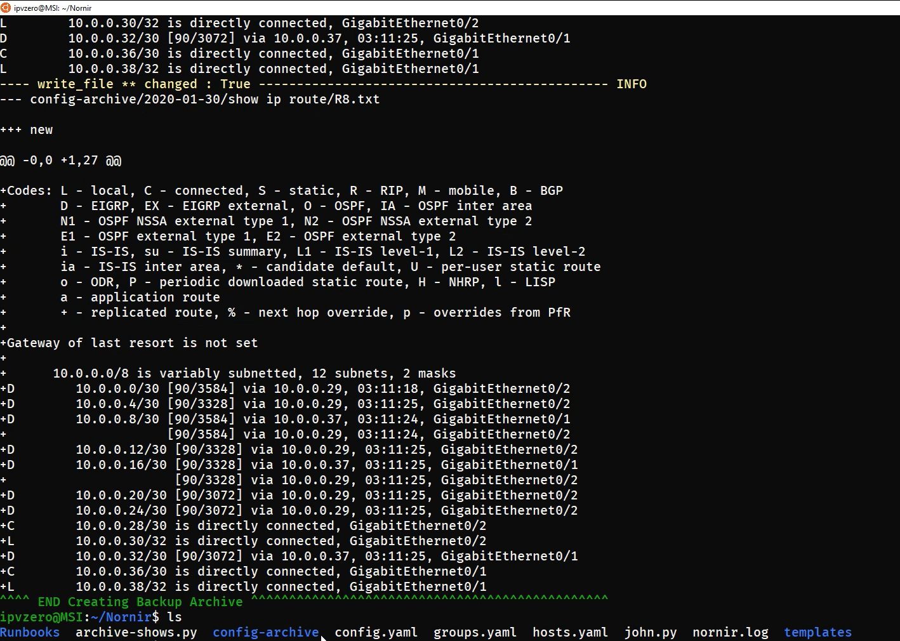

# Nornir - Archiving Telemetry

This code is based off my video: "Nornir (Python Network Automation) | Archiving Telemetry", which can be found [here](https://www.youtube.com/watch?v=VLOs6V-Xq5E)

Personal thank you and shout out to Stuart Clark @bigevilbeard for his contributions and help!


### Dependencies

```
pip3 install nornir
```


### Use Case Description



### About me
I am a Youtube content creator and Cybersecurity & Networks student with a strong interest in NetDevOps/Automation/Programmability.

Follow me on [Twitter](https://twitter.com/IPvZero)!

Thank you!


